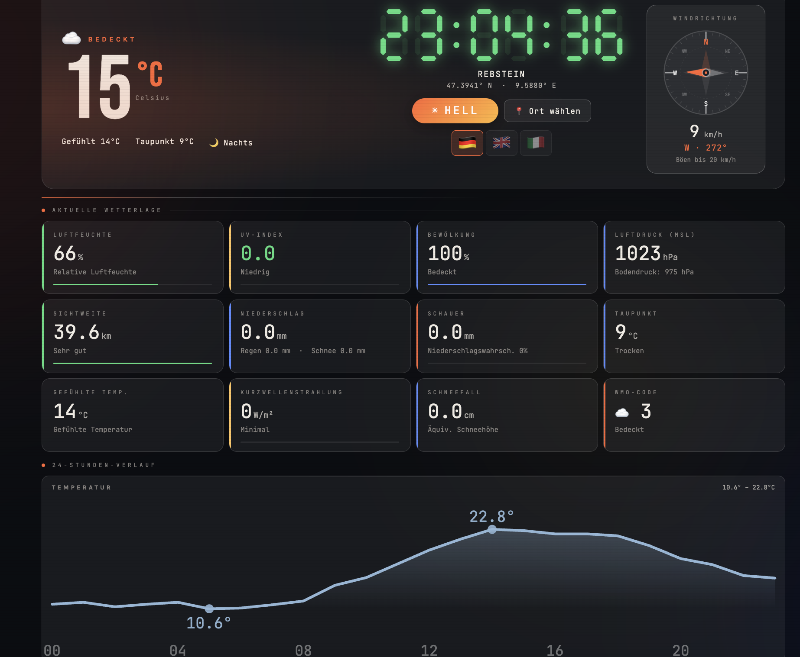

# 🌦️ WetterSymbol

A beautiful, real-time weather station dashboard displaying current conditions and hourly forecasts with a retro aesthetic.



## Features

- **Live Weather Data** — Real-time conditions powered by [Open-Meteo](https://open-meteo.com/) API (free, no authentication required)
- **Detailed Metrics** — Temperature, humidity, pressure, cloud cover, visibility, UV index, precipitation, dew point, and more
- **24-Hour Charts** — Interactive SVG charts showing temperature and precipitation trends
- **Wind Information** — Wind speed, direction, and gusts with visual compass indicator
- **Smart Geolocation** — Auto-detect your location or choose from a curated list of cities
- **Theme Toggle** — Light and dark modes with persistent storage
- **Multilingual** — English, German, French, Spanish, and more (interface automatically adapts to browser language)
- **Responsive Design** — Seamlessly adapts from mobile phones to desktop screens
- **No Dependencies** — Single HTML file, zero build tools, runs instantly in any modern browser

## Quick Start

1. **Open in Browser**

   ```bash
   open index.html
   # or simply drag index.html into your browser
   ```

2. **Allow Geolocation** — The app will ask for permission to detect your location automatically

3. **Explore** — Click the location button to choose from predefined cities or use the manual picker

## Usage

### Location Selection

- **Auto-detect**: Grant geolocation permission on first load
- **Manual picker**: Click the location button to browse countries and regions
- **Default fallback**: If geolocation is denied, displays Vienna, Austria

### Theme & Language

- **Toggle theme**: Click the theme button (light/dark mode) in the top-right
- **Change language**: Browser language is auto-detected; manually select via location menu
- **Preferences saved**: Both theme and language are stored in your browser

### Data Display

- **Hero section**: Large temperature display with "feels like" and dew point
- **Metrics cards**: Grid of detailed weather parameters
- **Charts**: Swipe left/right on mobile to view full 24-hour trends
- **Wind compass**: Visual indicator of wind direction and speed

## Architecture

**Single-file design**: Everything lives in `index.html`:

- Inline HTML structure
- Inline CSS with CSS custom properties for theming
- Inline vanilla JavaScript (no frameworks)

**No build process required** — just open the file and it works.

For detailed code documentation, see [CLAUDE.md](./CLAUDE.md).

## API & Data Sources

- **Weather Data**: [Open-Meteo](https://open-meteo.com/) — Free, real-time weather API
- **Reverse Geocoding**: Third-party API for location names
- **Browser Geolocation**: Native browser API for location detection

All requests are made directly from the browser — no backend server required.

## Browser Support

- Chrome 90+
- Firefox 88+
- Safari 14+
- Edge 90+

Requires:

- Modern JavaScript (ES6+)
- CSS Grid & Flexbox
- Geolocation API (optional, has fallback)
- localStorage

## Keyboard Shortcuts

- **T** — Toggle theme (dark/light)
- **L** — Open location selector
- **Esc** — Close menu panels

## Performance

- **Zero external CSS/JS files** — all styles and logic are inline
- **Lightweight SVG charts** — no heavy charting libraries
- **Minimal API calls** — single request to Open-Meteo per location update
- **Instant load** — opens instantly, no compilation or bundling step

## Customization

See [CLAUDE.md](./CLAUDE.md) for guidance on:

- Adding new metrics
- Adding new languages
- Modifying colors and themes
- Adjusting responsive breakpoints

## License

© 2026 WetterSymbol. Weather data provided by [Open-Meteo](https://open-meteo.com/).

---

**[See the code documentation](./CLAUDE.md)**
